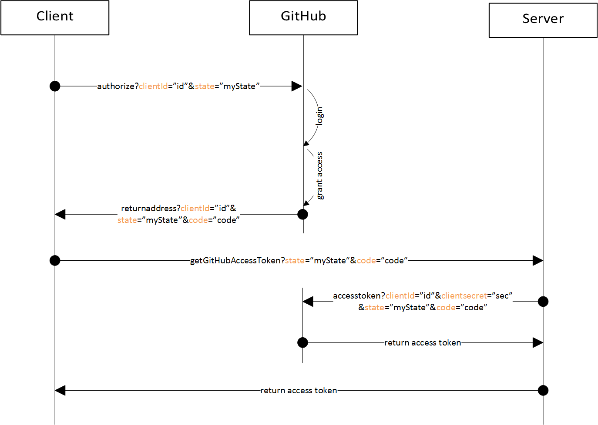

### oauth flow scheme  
image

### register your app in github
[Settings -> Developper settings](https://github.com/settings/developers)  
then define constants in config.php  
`define('GITHUB_CLIENT','dc37bed4efbdd799267e');
define('REDIRECT_URI','http://localhost:8000/connect');
define('GITHUB_SECRET','84d1a02888fb01f5c6c51ac7d4cf00605d5a427e');`

###install http client
`composer require symfony/http-client`  
to make requests and get responses

###install symfony/mime  
`composer require symfony/mime`  
to build the post body as a form data

###use this db for the poc  
[dump de user](user.sql)

[Lien Tuto Grafikart](https://grafikart.fr/tutoriels/oauth2-php-google-1171)